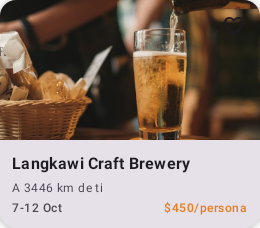
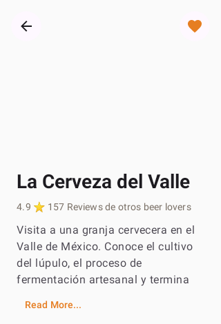
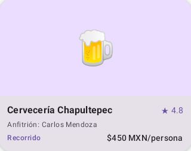

# BeerAirB 🍺

**Version 0.3.0**

Discover and book craft beer experiences in Mexico City. An Airbnb-style marketplace for beer lovers.

## Screenshots

Screenshots are organized by version in `screenshots/`. Each tagged release has its own subdirectory.

### v0.3.0 (current)

| Home Card | Detail Content |
|-----------|----------------|
|  |  |

### v0.0.1

| Home Card | Detail Content |
|-----------|----------------|
|  |  |

## Features

- **Browse Experiences** — Scroll through a curated list of craft beer activities
- **Search & Filter** — Find experiences by title, location, category, or host
- **Detail View** — See full descriptions, pricing, ratings, and host info
- **Booking CTA** — Ready-to-implement reservation button

## Tech Stack

| Component | Technology |
|-----------|------------|
| Language | Kotlin 2.2.10 |
| UI | Jetpack Compose + Material 3 + Montserrat |
| Architecture | MVVM + Repository |
| Navigation | Navigation Compose 2.9.0 |
| State Management | StateFlow + collectAsState() |
| Screenshot Testing | Roborazzi + Robolectric |
| DI | Manual constructor injection |
| Color Palette | Amber craft beer theme |
| Min SDK | 24 |
| Target SDK | 37 |
| Build | Gradle 9.3.1 + AGP 9.1.1 |

## Getting Started

```bash
# Build debug APK
./gradlew assembleDebug

# Run all unit tests (including screenshot tests)
./gradlew test

# Record screenshot baselines
./gradlew recordRoborazziDebug

# Verify screenshots against baselines
./gradlew verifyRoborazziDebug

# Run instrumented tests
./gradlew connectedAndroidTest
```

## Project Structure

```
com.mx.beerairb/
├── MainActivity.kt              # Entry point
├── data/
│   ├── model/
│   │   ├── BeerExperience.kt    # Data model
│   │   └── BeerAmenity.kt       # Amenity model
│   └── repository/
│       ├── BeerRepository.kt    # Repository interface
│       └── MockBeerRepository.kt # Mock data (6 experiences)
└── ui/
    ├── home/                    # Home list, search, categories, cards, banner
    ├── detail/                  # Hero, title, amenities, dates, booking
    ├── navigation/              # NavGraph, routes, MainScaffold
    ├── favorites/               # Favorites placeholder screen
    ├── messages/                # Messages placeholder screen
    ├── profile/                 # Profile placeholder screen
    └── theme/                   # Colors, typography, theme
```

## Changelog

### 0.3.0 (2026-07-03)
Detail screen parallax collapsing header, navigation animations, and alignment polish:

- **feat**: Parallax collapsing header on detail scroll (hero shrinks from 300dp to 120dp)
- **feat**: Enter/exit navigation transitions on Detail route (slide + fade)
- **feat**: HeroImageHeader scale-in + fade-in entrance animation
- **feat**: NearbyTaproomCard bounce-press feedback (scales to 0.97 on press)
- **style**: Consistent 24dp horizontal padding across all detail sections
- **test**: Updated screenshot baselines for v0.3.0

### 0.2.2 (2026-07-03)
Fix DetailViewModel crash on navigation:

- **fix**: Remove `SavedStateHandle` dependency from `DetailViewModel`
- **fix**: Add `DetailViewModelFactory` (ViewModelProvider.Factory) for controlled instantiation
- **fix**: Move ViewModel creation to `NavGraph` composable block with explicit factory

### 0.2.1 (2026-07-03)
Fix crash navigating to detail screen:

- **fix**: Pass `backStackEntry` as ViewModelStoreOwner to `viewModel()` call

### 0.2.0 (2026-07-03)
Replace emoji placeholders with real images from Unsplash:

- **feat**: Replace `imageRes: Int` with `imageUrl: String` in BeerExperience model
- **feat**: Add Coil (io.coil-kt:coil-compose:2.7.0) for async image loading
- **feat**: 6 real brewery/taproom photos from Unsplash CDN (no API key required)
- **feat**: Update NearbyTaproomCard and HeroImageHeader to use AsyncImage
- **feat**: Add INTERNET permission for remote image loading
- **chore**: Update screenshot baselines with real images
- Screenshots versioned under `screenshots/v0.2.0/`

### 0.1.0 (2026-07-03)
Design system overhaul and complete UI restructure:

- Screenshots versioned under `screenshots/v0.1.0/`
- **feat**: Amber/golden craft beer color palette (#E67E22 primary, cream bg, toasted text)
- **feat**: Montserrat font family throughout all typography
- **feat**: Custom Material 3 color scheme with brand consistency (no dynamic color)
- **feat**: BeerAmenity model, enhanced BeerExperience with distance/dateRange/reviewCount/amenities/isFavorite
- **feat**: Bottom navigation bar with 5 items (Home, Favorites, Beer FAB, Messages, Profile)
- **feat**: Home screen redesigned with SearchBar, CategorySelector (horizontal chips), NearbyTaproomCard (horizontal scroll), and ExploreBanner
- **feat**: Detail screen redesigned with HeroImageHeader, TitleRatingBlock, AmenitiesRow (4 pastel badges), DateSelector, and BookingBar
- **feat**: Category filtering and favorite toggling in HomeViewModel
- **feat**: Favorites, Messages, and Profile placeholder screens
- **feat**: `material-icons-extended` dependency for business, cabin, nature, chat icons
- **docs**: Updated README with v0.1.0 changelog and new tech stack
- **test**: Updated Roborazzi screenshot tests for new composables

### 0.0.2 (2026-07-03)
Add versioning and tagging workflow documentation:

- **docs**: Add semantic versioning rules to AGENTS.md and CLAUDE.md
- **docs**: Document tag format and `git push --tags` instructions

### 0.0.1 (2026-07-03)

Initial release. Core MVP with:

- Screenshots versioned under `screenshots/v0.0.1/`
- **feat**: BeerExperience model + repository layer
- **feat**: Navigation graph with sealed class routes (Home, Detail)
- **feat**: Home screen with search bar and experience list
- **feat**: Detail screen with experience info and booking CTA
- **feat**: MainActivity wiring with NavGraph, theme assets, and vector drawables
- **chore**: Build config updated to compileSdk 37 with navigation dependencies
- **docs**: AGENTS.md, CLAUDE.md, and README.md with full project documentation
- **test**: Roborazzi screenshot tests for home card and detail content

## Target Market

The app is built for the Mexican market — all UI strings are in Spanish.
