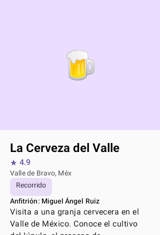

# BeerAirB 🍺

**Version 0.0.1**

Discover and book craft beer experiences in Mexico City. An Airbnb-style marketplace for beer lovers.

## Screenshots

| Home Card | Detail Content |
|-----------|----------------|
|  |  |

## Features

- **Browse Experiences** — Scroll through a curated list of craft beer activities
- **Search & Filter** — Find experiences by title, location, category, or host
- **Detail View** — See full descriptions, pricing, ratings, and host info
- **Booking CTA** — Ready-to-implement reservation button

## Tech Stack

| Component | Technology |
|-----------|------------|
| Language | Kotlin 2.2.10 |
| UI | Jetpack Compose + Material 3 |
| Architecture | MVVM + Repository |
| Navigation | Navigation Compose 2.9.0 |
| State Management | StateFlow + collectAsState() |
| Screenshot Testing | Roborazzi + Robolectric |
| DI | Manual constructor injection |
| Min SDK | 24 |
| Target SDK | 37 |
| Build | Gradle 9.3.1 + AGP 9.1.1 |

## Getting Started

```bash
# Build debug APK
./gradlew assembleDebug

# Run all unit tests (including screenshot tests)
./gradlew test

# Record screenshot baselines
./gradlew recordRoborazziDebug

# Verify screenshots against baselines
./gradlew verifyRoborazziDebug

# Run instrumented tests
./gradlew connectedAndroidTest
```

## Project Structure

```
com.mx.beerairb/
├── MainActivity.kt              # Entry point
├── data/
│   ├── model/
│   │   └── BeerExperience.kt    # Data model
│   └── repository/
│       ├── BeerRepository.kt    # Repository interface
│       └── MockBeerRepository.kt # Mock data (6 experiences)
└── ui/
    ├── home/                    # Home list + search
    ├── detail/                  # Experience detail
    ├── navigation/              # NavGraph + routes
    └── theme/                   # Colors, typography, theme
```

## Changelog

### 0.0.1 (2026-07-03)

Initial release. Core MVP with:

- **feat**: BeerExperience model + repository layer
- **feat**: Navigation graph with sealed class routes (Home, Detail)
- **feat**: Home screen with search bar and experience list
- **feat**: Detail screen with experience info and booking CTA
- **feat**: MainActivity wiring with NavGraph, theme assets, and vector drawables
- **chore**: Build config updated to compileSdk 37 with navigation dependencies
- **docs**: AGENTS.md, CLAUDE.md, and README.md with full project documentation
- **test**: Roborazzi screenshot tests for home card and detail content

## Target Market

The app is built for the Mexican market — all UI strings are in Spanish.
